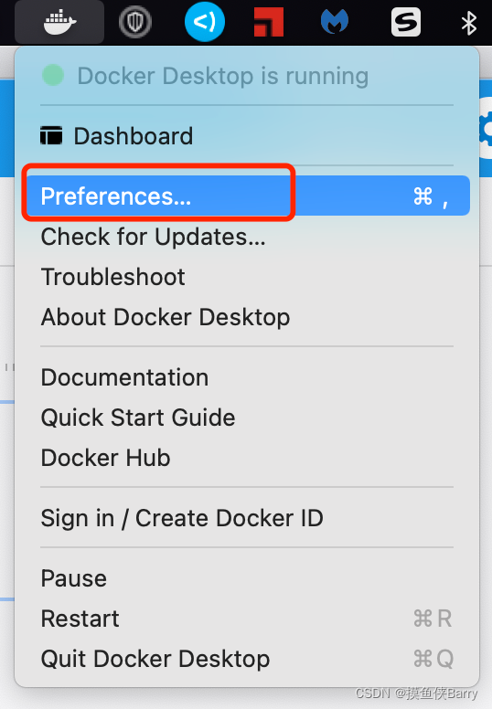
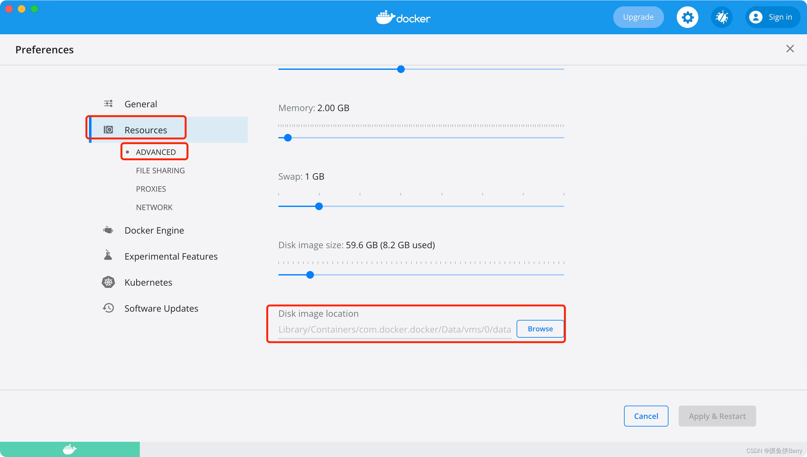

不同系统Docker容器与镜像默认存放位置

Linux: 存放位置如下

```shell
Linux:
cd /var/lib/docker - 容器与镜像存放在此目录下
镜像位置: /var/lib/docker/image
容器位置: /var/lib/docker/containers
```

Mac:

```shell
MacOS:
容器和镜像在如下目录下,不同版本或许可能文件版本不一样
/Users/xxxxmyname/Library/Containers/com.docker.docker/Data
可以到上面的目录中,查看文件大小, du -sh *
本机存放位置如下
/Users/xxxxmyname/Library/Containers/com.docker.docker/Data/vms/0/data/Docker.raw
```

也可通过图形界面查找

点击Preferences进入配置界面，然后找到Resources->ADVANCED，找到Disk image location即可





Windows:

打开界面设置，

Settings -> Resources -> Advanced -> Disk image location