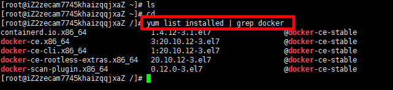
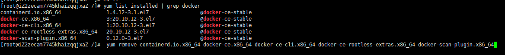

一、准备工作：

1.杀死docker有关的容器：
```shell
1.杀死docker有关的容器:
docker kill $(docker ps -a -q)
2.删除所有docker容器:
docker rm $(docker ps -a -q)
3.删除所有docker镜像:
docker rmi $(docker images -q)
4.停止 docker 服务:
systemctl stop docker
5.删除docker相关存储目录:分别进行执行以下四个命令
rm -rf /etc/docker
rm -rf /run/docker
rm -rf /var/lib/dockershim
rm -rf /var/lib/docker
6.如果删除不掉,则先umount:
umount /var/lib/docker/devicemapper
7.然后再重新执行上面那步"删除docker相关存储目录".
```

二、卸载工作

经过上面一系列准备后，我们终于到了最后环节，开始删除docker。

1.查看系统已经安装了哪些docker包：
```shell
[root@iZ2zecam7745khaizqqjxaZ /]# yum list installed | grep docker
containerd.io.x86_64 1.4.12-3.1.el7 @docker-ce-stable
docker-ce.x86_64 3:20.10.12-3.el7 @docker-ce-stable
docker-ce-cli.x86_64 1:20.10.12-3.el7 @docker-ce-stable
docker-ce-rootless-extras.x86_64 20.10.12-3.el7 @docker-ce-stable
docker-scan-plugin.x86_64 0.12.0-3.el7 @docker-ce-stable

```

卸载相关包：

[root@localhost ~]# yum remove containerd.io.x86_64 docker-ce.x86_64 docker-ce-cli.x86_64 docker-ce-rootless-extras.x86_64 docker-scan-plugin.x86_64



2.接着会出现选择提示，直接输入“y”然后回车就可以。

3.再次查看
```shell
yum list installed | grep docker
```

不再出现相关信息，证明删除成功，

4.再看看docker命令：

```shell
[root@iZ2zecam7745khaizqqjxaZ /]# docker version
-bash: /usr/bin/docker: No such file or directory
```
5.成功卸载docker