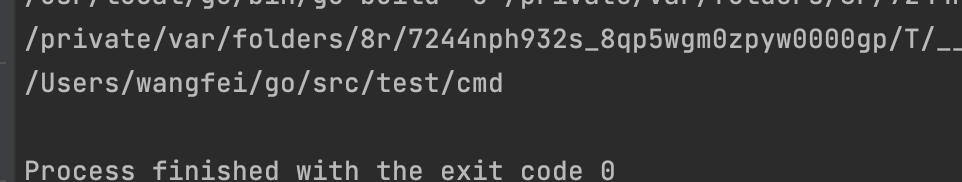
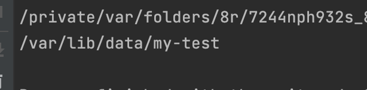
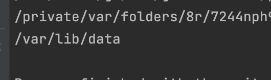
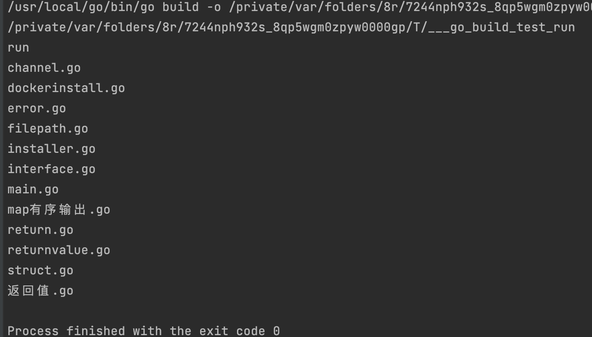
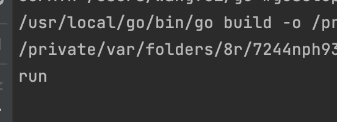
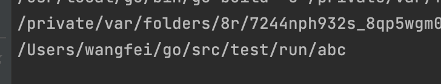

# golang的filepath包中的函数区别

## Abs 返回所给路径的绝对路径

```shell
filepath.Abs("./cmd")
```



## Clean 返回等价的最短路径

```shell
filepath.Clean("/var/lib/data/my-test")
```



## Dir 返回路径最后一个元素的目录

```shell
filepath.Clean("/var/lib/data/my-test")
```



## WalkDir 遍历自定义目录下的所有文件

```go
package main

import (
	"fmt"
	"io/fs"
	"path/filepath"
)

func main() {
	err := filepath.WalkDir("/Users/wangfei/go/src/test/run", func(path string, d fs.DirEntry, err error) error {
		fmt.Println(d.Name())
		return nil
	})
	if err != nil {
		return
	}
}
```



## Base 返回最后一个元素

```go
package main

import (
	"fmt"
	"path/filepath"
)

func main() {
	base := filepath.Base("/Users/wangfei/go/src/test/run")
	fmt.Println(base)
}
```



## Join 拼接路径

```go
package main

import (
	"fmt"
	"path/filepath"
)

func main() {
	join := filepath.Join("/Users/wangfei/go/src/test/run", "abc")
	fmt.Println(join)
}
```

