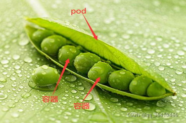

# Pod概述：概念、原理深度解读
## 1.1  带你梳理Pod概念、原理
什么是Pod？

Pod是Kubernetes中的最小调度单元，一个Pod封装一个容器（也可以封装多个容器），Pod里的容器共享存储、网络等。也就是说，可以把整个pod看作虚拟机，然后每个容器相当于运行在虚拟机的进程。同一个pod里的所有容器都被统一安排和调度。

白话解释：
可以把pod看成是一个“豌豆荚”，里面有很多“豆子”（容器）。一个豌豆荚里的豆子，它们吸收着共同的营养成分、肥料、水分等，Pod和容器的关系也是一样，Pod里面的容器共享pod的空间、资源、网络、存储等。

网络: 每一个Pod都会被指派一个唯一的Ip地址，在Pod中的每一个容器共享网络命名空间，包括Ip地址和网络端口。在同一个Pod中的容器可以通过locahost进行互相通信。当Pod中的容器需要与Pod外的实体进行通信时，则需要通过端口等共享的网络资源进行通信。

存储: 在Pod中所有的容器能够访问共享存储卷，允许这些容器共享数据。

总结：

1、pod是k8s的最小单元，容器包含在pod中，一个pod中有一个pause容器和若干个业务容器，而容器是单独的一个容器，简而言之，pod是一组容器的集合。

2、pod相当于逻辑主机，每个pod都有自己的ip地址

3、pod内的容器共享相同的ip和端口

4、默认情况下，每个容器的文件系统与其他容器完全隔离

什么是pause容器？

每个Pod里运行着一个特殊的被称之为Pause的容器，其他容器则为业务容器，这些业务容器共享Pause容器的网络栈和Volume挂载卷，因此他们之间通信和数据交换更为高效，在设计时我们可以充分利用这一特性将一组密切相关的服务进程放入同一个Pod中。同一个Pod里的容器之间仅需通过localhost就能互相通信。

pod、集群和容器有什么区别？

什么是容器？

容器的定义是一个包，其中有要执行的程序及其所有依赖关系，如操作系统、代码、运行时、系统库等，所有这些都绑定在一个盒子中。运行容器化的应用程序，尤其是在生产环境中，需要进行编排。这样就可以实现批量管理容器

容器本身可以运行程序，为什么还需要k8s？

Docker是容器中的代表，当Docker容器最早流行时，它们主要运行在一台计算机上（个人电脑），当人们清楚地认识到可以用容器代替虚拟机来运行应用程序时，它们开始在许多计算机上运行，因此就产生了管理许多容器的需要。

像Kubernetes这样的容器编排工具，其作用是使你能够自动化管理和调度由单个容器定义的应用程序，尤其是在微服务架构中，你可能会运行几十个或数百个，甚至数千个临时容器。对于许多团队来说，手动完成这项工作并不可取。因此需要对这些容器进行编排。

什么是pod？

在Kubernetes中部署应用时，都是以pod进行调度的，它们基本上是单个容器的包装或房子。从某种意义上说，容器的容器。 pod是一个逻辑包装实体，用于在K8s集群上执行容器。可以把每个pod想象成一个透明的包装，为容器提供一个插槽。pod是Kubernetes最小的可部署单位。pod是一组一个或多个容器，具有共享的存储/网络资源，以及如何运行容器的规范。因此，最简单地说，pod是一个容器如何在Kubernetes中“用起来”的机制。

什么是集群？

集群是Kubernetes基本架构的核心：如果运行Kubernetes，那么至少运行一个集群。

它们有一种共生关系：容器→pod→集群。

——容器在pod中逻辑化地运行；

——集群上运行一组相关或无关的pod。pod是集群上的一个复制单元；

——一个集群可以包含许多相关或不相关的pod，它们分组在被称为命名空间的逻辑边界里。

什么是节点？

它存在于pod和集群之间。在Kubernetes中，节点本质上是托管pod的机器，可以是物理机也可以是虚拟机

1.2  Pod如何管理多个容器
互动1：什么时候Pod里需要运行多个容器？

在一个Pod中同时运行多个容器是一种比较高级的用法，只有当你的容器需要紧密配合协作的时候才考虑用这种模式。例如，一个pod里有两个容器，这两个容器是共享存储卷的，有一个容器作为web服务器运行，另一个容器是为了给web服务提供配置文件的，如下图所示：

kubectl创建和删除一个pod相关操作
命令

说明

run

在集群上运行一个pod

create

使用文件或者标准输入的方式创建一个pod

delete

使用文件或者标准输入来删除某个pod

案例：创建一个名为nginx-learn的pod，暴露容器端口为80.

[root@master01 ~]# kubectl run nginx-learn  --image=nginx:latest --image-pull-policy='IfNotPresent'  --port=80
[root@master01 ~]# kubectl get pod
NAME                           READY   STATUS              RESTARTS   AGE
nginx-learn-64447db9cc-ff5h7   0/1     ContainerCreating   0          21s

#ContainerCreating状态为创建容器 稍等几分钟状态会变成Running

[root@master01 ~]# kubectl get pod
NAME                           READY   STATUS              RESTARTS   AGE
nginx-learn-64447db9cc-ff5h7   1/1     Running             0          15m

#删除容器

[root@master01 ~]# kubectl delete pod nginx-learn-64447db9cc-ff5h7
pod "nginx-learn-64447db9cc-ff5h7" deleted

#删除后会继续生成容器 需要删除deploy才能使其不在生成

[root@master01 ~]# kubectl get pod
NAME                           READY   STATUS    RESTARTS   AGE
nginx-learn-64447db9cc-hpzcc   1/1     Running   0          24s

[root@master01 ~]# kubectl get deploy
NAME          READY   UP-TO-DATE   AVAILABLE   AGE
nginx-learn   1/1     1            1           47m

#删除deploy

[root@master01 ~]# kubectl delete deploy nginx-learn
deployment.apps "nginx-learn" deleted

#已彻底删除

[root@master01 ~]# kubectl get deploy
No resources found in default namespace.
[root@master01 ~]# kubectl get pod
No resources found in default namespace.

注∶如果node结点上nginx:latest镜像没有，那么node会自动在dockerhub上下载。也可以改成自己的私有仓库地址:--image=192.168.xx.xxx/nginx:1.12
--image-pull-policy= 'IfNotPresent’ # 如果本地不存在镜像，那么才从外网下载镜像。默认值为: imagePullPolicy: Always 一直从外网，下载镜像，不用使用本地的。

Never:直接使用本地镜像，不再去外网拉取镜像;如果本地不存在就报异常了。

pods 常见的状态:
1.ContainerCreating #容器创建
2.ImagePullBackoff #从后端把镜像拉取到本地。
注︰如果这里pod没有正常运行，都是因为docker hub没有连接上，导致镜像没有下载成功，这时，可以在node节点上把相关镜像手动上传一下或把docker源换成阿里云的。
3.terminating #终止。当删除pod时的状态。
4.Running 正常运行状态。

1.3  自主式Pod和控制器管理的Pod
自主式pod：

在k8s中，我们部署pod的时候，基本上都是使用控制器管理，那如果不使用控制器，也可以直接定义一个pod资源，那么就是pod自己去控制自己，这样的pod称为自主式pod。

互动1：如何创建一个自主式Pod？

[root@master01 ~]# cat pod.yaml
apiVersion: v1
kind: Pod
metadata:
name: tomcat-pod
namespace: default
labels:
tomcat:  tomcat-pod
spec:
containers:
- name:  tomcat-pod-java
  ports:
    - containerPort: 8080
      image: tomcat:8.5-jre8-alpine
      imagePullPolicy: IfNotPresent
      #更新资源清单文件

[root@master01 ~]# kubectl apply -f pod.yaml
pod/tomcat-pod created

#查看刚才创建的pod

[root@master01 ~]#  kubectl get pods | grep tomcat
tomcat-pod   0/1     ContainerCreating   0          80s

上面定义的pod.yaml中，kind: Pod，这就是我们直接定义了一个pod资源，是自主式pod，

那我们如果不小心删除这个pod，大家看下效果：

[root@master01 ~]#  kubectl get pods | grep tomcat
tomcat-pod   0/1     ContainerCreating   0          80s
[root@master01 ~]#  kubectl get pods | grep tomcat
tomcat-pod   1/1     Running   0          6m41s
[root@master01 ~]# kubectl delete pod tomcat-pod
pod "tomcat-pod" deleted
[root@master01 ~]# kubectl get pods | grep tomcat
No resources found in default namespace.
上面实验可以看到，当我们把pod删除之后，pod不会再创建一个新的pod，而是彻底从机器上删除了，这种自主式pod适合测试环境或者非核心业务场景，如果生产环境用自主式pod部署应用，那是存在风险的，所以，我们平时管理Pod都是通过控制器去管理的。

控制器管理的Pod：

生产环境中可以用控制器创建和管理多个pod。控制器在pod失败的情况下可以处理副本、更新以及自动修复。控制器可以指定创建的pod副本数，使其管理的pod始终维持在指定副本数量，例如，如果某个节点发生故障，则控制器会注意到该节点上的Pod已停止工作，并创建一个新的pod替换有故障的Pod。调度程序将替换的Pod放置到健康的节点上。可以使用Deployment、Statefulset、Daemonset、Job等控制器管理pod。如何通过控制器管理Pod？

控制器是通过创建pod模板来创建和管理pod的，PodTemplate是用于创建pod的规范，并且包含在Deployment等控制器中。每个控制器使用自己内部的Pod模板来创建实际的Pod。下面的示例是一个简单的Job的清单，包含一个podtemplate，这个是用来生成pod的模板。该Pod中的容器会打印一条消息，然后暂停。

cat job-template.yaml
apiVersion: batch/v1
kind: Job
metadata:
name: hello
spec:
template:
# This is the pod template
spec:
containers:
- name: hello
image: busybox
command: ['sh', '-c', 'echo "Hello, Kubernetes!" && sleep 3600']
restartPolicy: OnFailure
通过Deployment创建一个pod资源：

[root@master01 ~]# cat deployment.yaml
apiVersion: apps/v1
kind: Deployment
metadata:
name: my-nginx
spec:
selector:
matchLabels:
run: my-nginx
replicas: 2
template:
metadata:
labels:
run: my-nginx
spec:
containers:
- name: my-nginx
image: nginx
ports:
- containerPort: 80
[root@master01 ~]# kubectl apply -f deployment.yaml
deployment.apps/my-nginx created
[root@master01 ~]# kubectl get deploy
NAME       READY   UP-TO-DATE   AVAILABLE   AGE
my-nginx   1/2     2            1           10s
[root@master01 ~]# kubectl get rs
NAME                  DESIRED   CURRENT   READY   AGE
my-nginx-75897978cd   2         2         1       46s
[root@master01 ~]# kubectl get pods
NAME                        READY   STATUS              RESTARTS   AGE
my-nginx-75897978cd-h6j4g   1/1     Running             0          65s
my-nginx-75897978cd-zq7vg   0/1     ContainerCreating   0          65s

#通过上面可以看到创建deployment资源的时候，会生成rs和相应的pod

#假如误删除其中一个pod：my-nginx-75897978cd-h6j4g

[root@master01 ~]# kubectl get pods
NAME                        READY   STATUS    RESTARTS   AGE
my-nginx-75897978cd-h6j4g   1/1     Running   0          2m27s
my-nginx-75897978cd-zq7vg   1/1     Running   0          2m27s
[root@master01 ~]# kubectl delete pod my-nginx-75897978cd-h6j4g
pod "my-nginx-75897978cd-h6j4g" deleted
[root@master01 ~]# kubectl get pods
NAME                        READY   STATUS    RESTARTS   AGE
my-nginx-75897978cd-tvs29   1/1     Running   0          55s
my-nginx-75897978cd-zq7vg   1/1     Running   0          3m42s

[root@master01 ~]#  kubectl get pod -o wide  #详细信息
NAME                        READY   STATUS    RESTARTS   AGE   IP              NODE     NOMINATED NODE   READINESS GATES
my-nginx-75897978cd-tvs29   1/1     Running   0          28m   10.122.140.74   node02   <none>           <none>
my-nginx-75897978cd-zq7vg   1/1     Running   0          31m   10.122.2.3      node01   <none>           <none>

通过上面可以发现，删除一个pod之后，控制器会自动生成一个新的pod my-nginx-75897978cd-tvs29

总结:get命令能够确认的信息类别:
deployments(缩写deploy)
events (缩写ev)
namespaces (缩写ns)
nodes(缩写no)
pods (缩写po)
replicasets(缩写rs)
replicationcontrollers(缩写rc)
services(缩写svc)

使用describe查看k8s 中详细信息
describe [dI'skrarb]描述.
语法:kubectl describe pod pod名字
语法:kubectl describe node node 名字。
语法:kubectl describe deployment deployment名字

1.使用describe查看pod的详细描述信息

[root@master01 ~]#  kubectl get pod -o wide
NAME                        READY   STATUS    RESTARTS   AGE   IP              NODE     NOMINATED NODATES
my-nginx-75897978cd-tvs29   1/1     Running   0          28m   10.122.140.74   node02   <none>       
my-nginx-75897978cd-zq7vg   1/1     Running   0          31m   10.122.2.3      node01   <none>       
[root@master01 ~]# kubectl describe pod my-nginx-75897978cd-tvs29
Name:         my-nginx-75897978cd-tvs29
Namespace:    default
Priority:     0
Node:         node02/192.168.59.132
Start Time:   Sat, 30 Oct 2021 16:12:02 +0800
Labels:       pod-template-hash=75897978cd
run=my-nginx
Annotations:  cni.projectcalico.org/podIP: 10.122.140.74/32
cni.projectcalico.org/podIPs: 10.122.140.74/32
Status:       Running
IP:           10.122.140.74
IPs:
IP:           10.122.140.74
Controlled By:  ReplicaSet/my-nginx-75897978cd
Containers:
my-nginx:
Container ID:   docker://6d9e30a728ac89e86b7f678256e4e55558801bfe04d3b6349c685defd1d10161
Image:          nginx
Image ID:       docker-pullable://nginx@sha256:644a70516a26004c97d0d85c7fe1d0c3a67ea8ab7ddf4aff193d9f301670cf36
Port:           80/TCP
Host Port:      0/TCP
State:          Running
Started:      Sat, 30 Oct 2021 16:12:06 +0800
Ready:          True
Restart Count:  0
Environment:    <none>
Mounts:
/var/run/secrets/kubernetes.io/serviceaccount from default-token-t266p (ro)
Conditions:
Type              Status
Initialized       True
Ready             True
ContainersReady   True
PodScheduled      True
Volumes:
default-token-t266p:
Type:        Secret (a volume populated by a Secret)
SecretName:  default-token-t266p
Optional:    false
QoS Class:       BestEffort
Node-Selectors:  <none>
Tolerations:     node.kubernetes.io/not-ready:NoExecute for 300s
node.kubernetes.io/unreachable:NoExecute for 300s
Events:
Type    Reason     Age        From               Message
  ----    ------     ----       ----               -------
Normal  Scheduled  <unknown>  default-scheduler  Successfully assigned default/my-nginx-75897978cd-tvs29 to node02
Normal  Pulling    57m        kubelet, node02    Pulling image "nginx"
Normal  Pulled     57m        kubelet, node02    Successfully pulled image "nginx"
Normal  Created    57m        kubelet, node02    Created container my-nginx
Normal  Started    57m        kubelet, node02    Started container my-nginx
2. 使用describe查看node的详细描述信息

kubectl describe node node01    #查看详细信息

3. 使用describe查看deployment的详细描述信息

kubectl describe deployment mysql

kubectl其他常用命令和参数说明
命令              说明

logs                取得pod中容器的log信息

exec               在pod中执行一条命令、登录到pod

cp                  从pod拷出或向pod拷入文件

attach            Attach附加到一个运行中的pod上，实时查看pod消息

[root@master01 ~]# kubectl logs my-nginx-75897978cd-tvs29
/docker-entrypoint.sh: /docker-entrypoint.d/ is not empty, will attempt to perform configuration
/docker-entrypoint.sh: Looking for shell scripts in /docker-entrypoint.d/
/docker-entrypoint.sh: Launching /docker-entrypoint.d/10-listen-on-ipv6-by-default.sh
10-listen-on-ipv6-by-default.sh: info: Getting the checksum of /etc/nginx/conf.d/default.conf
10-listen-on-ipv6-by-default.sh: info: Enabled listen on IPv6 in /etc/nginx/conf.d/default.conf
/docker-entrypoint.sh: Launching /docker-entrypoint.d/20-envsubst-on-templates.sh
/docker-entrypoint.sh: Launching /docker-entrypoint.d/30-tune-worker-processes.sh
/docker-entrypoint.sh: Configuration complete; ready for start up
2021/10/30 08:12:06 [notice] 1#1: using the "epoll" event method
2021/10/30 08:12:06 [notice] 1#1: nginx/1.21.3
2021/10/30 08:12:06 [notice] 1#1: built by gcc 8.3.0 (Debian 8.3.0-6)
2021/10/30 08:12:06 [notice] 1#1: OS: Linux 3.10.0-1160.el7.x86_64
2021/10/30 08:12:06 [notice] 1#1: getrlimit(RLIMIT_NOFILE): 1048576:1048576
2021/10/30 08:12:06 [notice] 1#1: start worker processes
2021/10/30 08:12:06 [notice] 1#1: start worker process 32
2021/10/30 08:12:06 [notice] 1#1: start worker process 33
2021/10/30 08:12:06 [notice] 1#1: start worker process 34
2021/10/30 08:12:06 [notice] 1#1: start worker process 35
[root@master01 ~]# kubectl exec -it my-nginx-75897978cd-tvs29
error: you must specify at least one command for the container
[root@master01 ~]# kubectl exec -it my-nginx-75897978cd-tvs29 bash
root@my-nginx-75897978cd-tvs29:/# hostname -I
10.122.140.74
root@my-nginx-75897978cd-tvs29:/# exit
exit
[root@master01 ~]#
kubectl cp
用于从pod中拷出hosts文件到物理机的/tmp下
[root@master01~]# kubectl cp mysql-77596d4dcb-wrgmt:/etc/hosts  /tmp/hosts
command terminated with exit code 126    #报错
排错方法
[root@master01~]# kubectl  cp --help
Copy files and directories to and from containers.
Examples:
# !!!Important Note!!!
# Requires that the 'tar' binary is present in your container   #发现想要使用kubectl cp你的容器实例中必须有tar库
# image.  If 'tar' is not present, 'kubectl cp' will fail. #如果镜像中tar命令不存在，那么kubectl cp将失败

安装mysql  pod中安装tar命令：
[root@master01~]# kubectl  exec -it mysql-77596d4dcb-wrgmt bash
创建阿里yum源，默认此镜像中带的是oracle的源，如果不能使用，就自己创建。
bash-4.2# mv /etc/yum.repos.d/public-yum-ol7.repo /opt/
bash-4.2# cat >  /etc/yum.repos.d/CentOS-Base.repo  <<EOF
[base]
name=CentOS7
baseurl=http://mirrors.aliyun.com/centos/7/os/x86_64/
gpgcheck=0
EOF

bash-4.2# yum install tar -y

在pod中创建一个文件message.log
bash-4.2#  echo "this is a message from xuegod.cn" >  /tmp/message.log
bash-4.2# exit

拷贝出来并确认
[root@master01~]# kubectl cp mysql-77596d4dcb-wrgmt:/tmp/message.log message.log
tar: Removing leading `/' from member names
[root@master01~]# cat message.log
this is a message from mysql-77596d4dcb-wrgmt

更改message.log并拷贝回pod
[root@master01~]# echo " Hello World！！！" >>message.log
[root@master01~]# kubectl cp message.log mysql-77596d4dcb-wrgmt:/tmp/message.log
确认更改后的信息
[root@master01~]# kubectl exec mysql-77596d4dcb-wrgmt cat /tmp/message.log
this is a message from mysql-77596d4dcb-wrgmt
Hello World！！！

kubectl attach
kubectl attach用于取得pod中容器的实时信息，可以持续不断实时的取出消息。像tail -f /var/log/messages  动态查看日志的作用。

kubectl logs是一次取出所有消息，像cat /etc/passwd

[root@master01 ~]#  kubectl attach mysql-77596d4dcb-wrgmt

注： 到现在，所创建nginx只是deployment设备硬件资源，并没有对应service服务，所以现在还不能直接在外网进行访问nginx服务。

使用Deployment方式启动nginx的pod和service

[root@master01 ~]# vim  /root/nginx-deployment.yaml   #查看配置文件
kind: Deployment
apiVersion: apps/v1
metadata:
name: nginx
namespace: default
labels:
k8s-app: nginx
spec:
selector:
matchLabels:
k8s-app: nginx
replicas: 2    #创建两个pod
template:
metadata:
labels:
k8s-app: nginx
spec:
containers:
- name: nginx
image: nginx:latest
imagePullPolicy: IfNotPresent  
ports:
- containerPort: 80
protocol: TCP

[root@master01 ~]# vim  /root/nginx-svc.yaml    #查看service 文件
kind: Service
apiVersion: v1
metadata:
name: nginx
labels:
k8s-app: nginx
spec:
type: NodePort
ports:
- protocol: TCP
  nodePort: 31001
  targetPort: 80
  port: 3000
  selector:
  k8s-app: nginx
  注：

  nodePort: 31001 #指定是node物理机上监控听的端口，后期公网上的机器，可以访问此端口。

  targetPort: 80   #nginx pod的端口号，也就是真正docker监听的端口号

  port: 3000    #service 服务端口号 service 集群IP监听的端口，K8S内部各个service服务，使用这个端口号进行通信

开始创建：

[root@master01 ~]# kubectl create -f nginx-deployment.yaml
deployment.apps/nginx created
[root@master01 ~]# kubectl create -f nginx-svc.yaml
service/nginx created

查看创建的： pod、deployment、service

[root@master01 ~]# kubectl get pod -o wide
NAME                        READY   STATUS    RESTARTS   AGE     IP              NODE     NOMINATED NODE   READINESS GATES
nginx-7d85897464-5thd4      1/1     Running   0          2m41s   10.122.140.76   node02   <none>           <none>
nginx-7d85897464-czbf4      1/1     Running   0          2m41s   10.122.140.75   node02   <none>           <none>

[root@master01 ~]#  kubectl get deploy
NAME       READY   UP-TO-DATE   AVAILABLE   AGE
nginx      2/2     2            2           3m59s

[root@master01 ~]# kubectl get service  ##或者 kubectl get svc
NAME         TYPE        CLUSTER-IP     EXTERNAL-IP   PORT(S)          AGE
kubernetes   ClusterIP   10.10.0.1      <none>        443/TCP          18h
nginx        NodePort    10.10.31.159   <none>        3000:31001/TCP   3m25s
注：发现service 3000端口已经映射到node物理机节点的31001端口上了。可以查看到我这个nginx服务已经运行在node2上。

尽管ngixn的pod是在node2运行的，但我们去访问任意node，都可以正常访问nginx的。已经做了负载均衡。

kubectl维护k8s集群相关命令
实战环境：k8s集群中，发生了以下情况：有一个pod坏了，pod要镜像要升级，pod中nginx服务器的配置文件要修改，pod镜像要替换，要多起一个pod，node物理机要升级内存，不想在这个node物理机上运行新的pod等情况。怎么操作？

kubectl相关命令参数如下：

kubectl    edit     编辑服务器侧资源

kubectl    replace   替换，使用yaml配置文件来替换正在运行中的配置参数

kubectl    patch     部分更新资源相关信息

kubectl    apply      使用文件或者标准输入更改配置信息

kubectl    scale       重新设定Deployment/ReplicaSet/RC/Job的size

kubectl    autoscale       Deployment/ReplicaSet/RC的自动扩展设定

kubectl    cordon   设定node不可使用

kubectl    uncordon      设定node可以使用

kubectl    drain      设定node进入维护模式

Pod资源清单的定义方法
2.1  pod资源清单配置基础
在创建pod的时候，可以通过写资源清单文件去实现，Pod资源清单文件中有几个重要的部分：apiVersion、kind、metadata、spec以及status，其中apiVersion和kind是比较固定的，status是运行时的状态，所以最重要的就是metadata和spec两个部分。

#查看pod中包含哪些字段，可以使用kubectl explain命令：

[root@master01 ~]# kubectl explain pods
KIND:     Pod
VERSION:  v1

DESCRIPTION:
Pod is a collection of containers that can run on a host. This resource is
created by clients and scheduled onto hosts.

FIELDS:
apiVersion    <string>
APIVersion defines the versioned schema of this representation of an
object. Servers should convert recognized schemas to the latest internal
value, and may reject unrecognized values. More info:
https://git.k8s.io/community/contributors/devel/sig-architecture/api-conventions.md#resources

kind    <string>
Kind is a string value representing the REST resource this object
represents. Servers may infer this from the endpoint the client submits
requests to. Cannot be updated. In CamelCase. More info:
https://git.k8s.io/community/contributors/devel/sig-architecture/api-conventions.md#types-kinds

metadata    <Object>
Standard object's metadata. More info:
https://git.k8s.io/community/contributors/devel/sig-architecture/api-conventions.md#metadata

spec    <Object>
Specification of the desired behavior of the pod. More info:
https://git.k8s.io/community/contributors/devel/sig-architecture/api-conventions.md#spec-and-status

status    <Object>
Most recently observed status of the pod. This data may not be up to date.
Populated by the system. Read-only. More info:
https://git.k8s.io/community/contributors/devel/sig-architecture/api-conventions.md#spec-and-status

apiVersion:  v1

#属性名：属性值；

v1表示我们定义的pod属于k8s哪个api的版本，一般apiversion后面的值的格式是group/version，如果group省略，表示的是核心组，那么v1就是核心组上的资源。

#查看k8s中有哪些api版本

[root@master01 ~]# kubectl api-versions
admissionregistration.k8s.io/v1
admissionregistration.k8s.io/v1beta1
apiextensions.k8s.io/v1

...............

....省略....

..............
scheduling.k8s.io/v1beta1
storage.k8s.io/v1
storage.k8s.io/v1beta1
v1

上面可以显示api的群组和版本，v1是核心群组，同一个组有很多版本，为什么分组进行管理：如果不分组，那么更新一个，所有的都更新，分组以后，某一个组改变了，只需要改变一个，其他不需要改变；分组后同一个群组的不同版本号也能并存；因为pod是最核心的资源，因此属于核心群组v1。控制器deployment，replicatset都属于应用程序广义的核心资源，属于apps/v1这个群组

注：apps有下面三个版本，v1是表示测试通过的稳定版本，beta1是公测版本，不稳定，有可能被改变，alpha内测版本，不能使用

apps/v1

apps/v1beta1

apps/v1beta2

kind:  Pod

资源类别，告诉我们要创建的资源是什么？如创建一个pod还是service还是deployment，

这些不能随意定义，一般都是内建的或者用户自定义的，需要按照固定语法格式自定义。

metadata

元数据，元数据下面可以定义资源的名字和所属的名称空间，以及资源的标签，通过kubectl explain可以查看元数据下的所有子字段：

[root@master01 ~]# kubectl explain pods.metadata
KIND:     Pod
VERSION:  v1
RESOURCE: metadata <Object>
DESCRIPTION:
Standard object's metadata. More info:
https://git.k8s.io/community/contributors/devel/sig-architecture/api-conventions.md#metadata
ObjectMeta is metadata that all persisted resources must have, which
includes all objects users must create.
FIELDS:  #这里我只是列举了一些常用的字段
annotations      <map[string]string>  #资源的注解
Annotations is an unstructured key value map stored with a resource that
may be set by external tools to store and retrieve arbitrary metadata. They
are not queryable and should be preserved when modifying objects. More
info: http://kubernetes.io/docs/user-guide/annotations
labels  <map[string]string>  #标签，给定义的资源打个标签
Map of string keys and values that can be used to organize and categorize
(scope and select) objects. May match selectors of replication controllers
and services. More info: http://kubernetes.io/docs/user-guide/labels
name  <string>   #名字，给定义的资源起个名字
Name must be unique within a namespace. Is required when creating
resources, although some resources may allow a client to request the
generation of an appropriate name automatically. Name is primarily intended
for creation idempotence and configuration definition. Cannot be updated.
More info: http://kubernetes.io/docs/user-guide/identifiers#names
namespace <string>   #创建资源的时候分配的名称空间
Namespace defines the space within which each name must be unique.
spec（非常重要的字段）

spec中需要嵌套很多二级字段和三级字段，不同的资源类型spec需要嵌套的字段各不相同

如果某个字段的标题属性是require（必选字段），剩下的都是可选字段，我们系统会给它赋予

默认值，不同的资源类型spec值是各不相同的，它是用户定义的期望状态。

kubectl explain pods.spec
status：

表示当前状态，有些内嵌的字段是系统自主维护的，只读属性，不能修改

参考：https://blog.csdn.net/qq_36410466/article/details/121050508?ops_request_misc=%257B%2522request%255Fid%2522%253A%2522171512921816800226526799%2522%252C%2522scm%2522%253A%252220140713.130102334..%2522%257D&request_id=171512921816800226526799&biz_id=0&utm_medium=distribute.pc_search_result.none-task-blog-2~all~top_positive~default-1-121050508-null-null.142^v100^control&utm_term=pod&spm=1018.2226.3001.4187